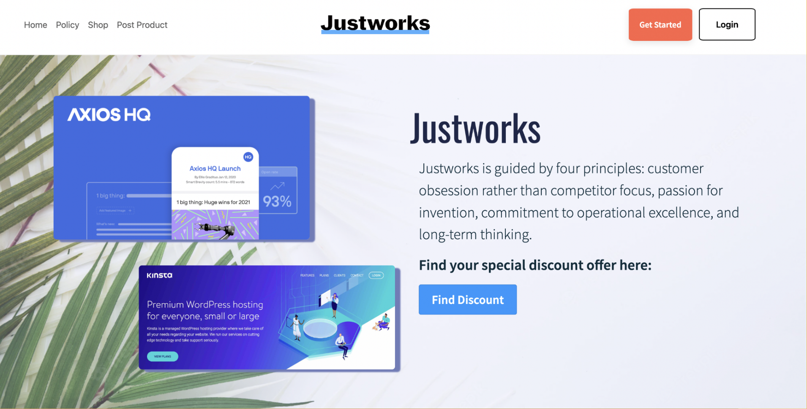

# Justworks-Marketplace 

### Project Description

Justworks is a software company that makes work and life easier to navigate with Payroll, benefits, HR, and compliance! Sprinterns from Breakthrough Tech NY were tasked to create a marketplace that would connect Justwork clients and offer solutions such as: 

1. Bridging the gap between customers 
2. Supporting small businesses thrive
3. Low-budget marketing (B2B and offering SaaS) 
4. Visibility and growth

[Linkedin Post: ](https://www.linkedin.com/feed/update/urn:li:activity:7022676129144557568/)
The Sprinterns: Hafeefa Sultan, Rachel Cyren, Naomi Williams, Tong Lin, and myself want to thank Justworks for giving us the opportunity to present our project at the company's All Hand meeting! Thanks to Break Through Tech connecting us with our host company, we opened a door to the world of Software Engineering. And special thanks to Brian Hartle, Biren Patel, Jacqueline Baydar, and Gabe H. for being wonderful mentors during the internship. 

## Sid's Take
This was my first time working with a team in a professional setting in comparison to remote mini projects I've done in the past in programs. I got to learn about the life of Software Engineer in a real-world setting and it was quite the experience. It's a shame it only lasted a month, so I'm hoping to come back next summer to get the full deal! I'll see you soon Justworks. Thank you to everyone who supported us. I wanted to give a special thank to all the different employees that talked to us about their specific roles, ranging from Front End and Back End developers to Lead Product Managers. I took so many notes, and it helped me understand the many paths I can take once I adopt the umbrella of Software Engineering itself. 

Sid

Group-Project 1

Time: January 2023
